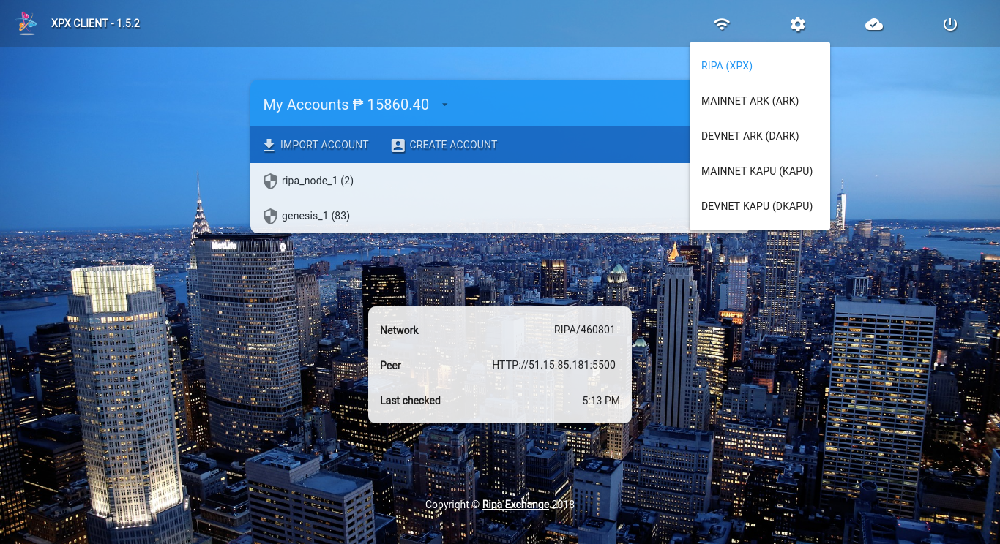
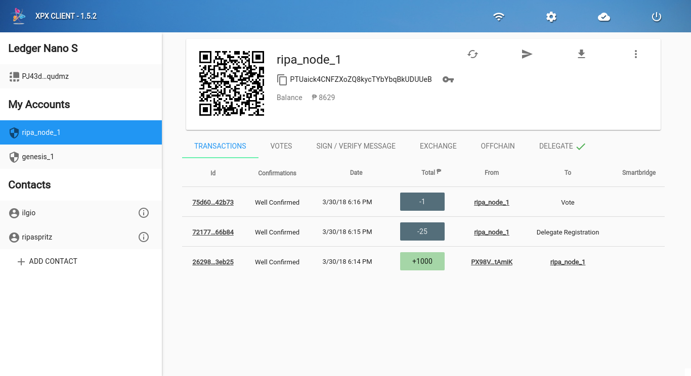

[](https://travis-ci.org/RipaEx/ripa-desktop)
[](https://github.com/RipaEx/ripa-desktop/releases/latest)
[](https://github.com/RipaEx/ripa-desktop/releases/latest)
[](https://gitter.im/RipaEx/Lobby)

## Download
[Latest Release](https://github.com/RipaEx/ripa-desktop/releases)

## Features
* Available on ***Windows***, ***Linux*** (Ubuntu/Debian) and ***MacOSX*** (signed).
* No need to download ARK blockchain, just sync to the network: launch and use within seconds.
* View any account from its address (transactions, delegate status and votes).
* Label any account and add your own contacts.
* Hardware wallet support : Ledger Nano S.
* Real-time currency value (updated every 5 min) in USD, EUR, BTC, HKD, JPY, CNY, AUD, GBP, Rubble, ...
* Autoconnect to a healthy ARK network peer. If the peer is not good anymore, it will automatically find a new one.
* Send ark from / to any account.
* Easily switch to a different network, or private chains.
* Customized backgrounds and themes for better user experience.
* Choose between dark or light mode.
* Isolated processes on Windows and MacOSX to prevent from data sniffing or injection.
* Translations (thanks to the ARK community) - help out http://osjc1wl.oneskyapp.com/collaboration/project?id=95031
* Organise your accounts with virtual folders (for instance savings, personnal etc...) so you don't pay any transfer fee (stored locally).
* Change your delegate vote.
* When new version is available, message is shown in the right upper part.
* Easy to update - download latest version, start installation program and it will automatically remove previous version and install new one.
* Second signature supported.
* (soon) Deposit or withdraw ARK using altcoins or USD (via exchange) - no registration needed.
* (soon) Multisignature accounts.
* **SAVE YOUR PASSPHRASE(S) - if you lose it, you lose access to that particular ARK address(es). There is no forgot my password option with blockchains and no one can help you retrieve it!**


## Screenshots



## Build

To clone and run this repository you'll need [Git](https://git-scm.com) and [Node.js](https://nodejs.org/en/download/) (which comes with [npm](http://npmjs.com)) installed on your computer. Optionally switch to node 6.9.2, because this is currently developed with this version:
```
sudo npm install -g n
sudo n 6.9.2
```

Install from source:
```bash
# Clone this repository
git clone https://github.com/RipaEx/ripa-desktop
# Go into the repository
cd ripa-desktop
# Install dependencies
npm install
```

* In some cases, [node-hid](https://github.com/node-hid/node-hid) doesn't provide pre-built binaries, so is necessary to install the [node-hid dependencies](https://github.com/node-hid/node-hid#compiling-from-source) to build them from source before running `npm install`.

Then start:
```bash
npm start
```

### Requirements to build from OS X

```
brew tap Homebrew/bundle
brew bundle
```

## Contributing

* If you find any bugs, submit an [issue](../../issues) or open [pull-request](../../pulls), helping us catch and fix them.
* Engage with other users and developers on [ARK Slack](https://ark.io/slack/).
* Join to our [gitter](https://gitter.im/ark-developers/Lobby).
* [Contribute bounties](./CONTRIBUTING.md).

## Authors
- Giovanni Silvestri <gsit80@gmail.com>
- FX Thoorens <fx@ark.io>
- Guillaume Verbal <doweig@ark.io>
- Lúcio Rubens <lucio@ark.io>
- Juan Martín <juan@ark.io>

## License

RIPA Desktop is licensed under the MIT License - see the [LICENSE](./LICENSE) file for details.
